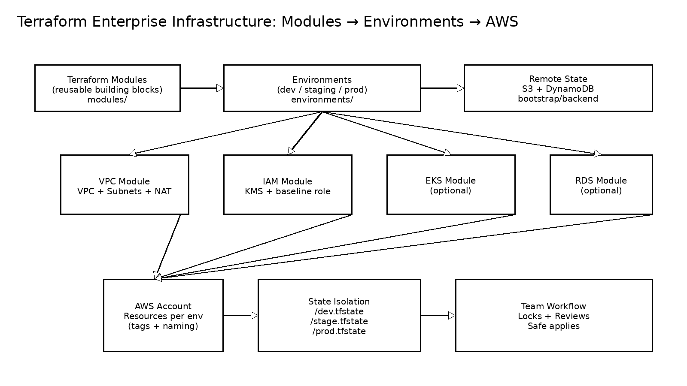

<p align="center">
  
</p>

<h1 align="center">
Terraform Enterprise Infrastructure
</h1>

<p align="center">
Reusable Modules • Multi-Environment • Production-Grade Architecture
</p>

<p align="center">


</p>

---

# Overview

This repository demonstrates a **production-grade Terraform enterprise infrastructure architecture** using:

- Reusable Terraform modules
- Multi-environment deployment
- Remote state management with locking
- Enterprise security and IAM baseline
- Scalable and maintainable infrastructure design

This mirrors how **real companies manage AWS infrastructure safely and at scale**.

---

# Architecture

<p align="center">
  
</p>

---

# Enterprise Infrastructure Components

## Core Infrastructure

- VPC with public and private subnets
- NAT Gateway
- IAM roles and policies
- KMS encryption keys
- Security group baseline
- Remote state backend

## Optional Infrastructure

- EKS Kubernetes cluster
- RDS managed database

---

# Enterprise Design Principles

## 1. Modular Architecture

Reusable modules:

```
modules/
├── vpc/
├── eks/
├── rds/
└── iam/
```

Benefits:

- Reusable infrastructure
- Easier maintenance
- Enterprise standardization

---

## 2. Environment Isolation

Separate environments:

```
environments/
├── dev/
├── staging/
└── prod/
```

Each environment has:

- Separate Terraform state
- Separate configuration
- Separate infrastructure

Prevents production impact from dev/testing.

---

## 3. Remote State Management

Uses:

- S3 for state storage
- DynamoDB for state locking

Benefits:

- Safe team collaboration
- Prevents state corruption
- Enterprise-grade workflow

---

# Repository Structure

```
terraform-enterprise-infrastructure/
│
├── modules/
│   ├── vpc/
│   ├── eks/
│   ├── rds/
│   └── iam/
│
├── environments/
│   ├── dev/
│   ├── staging/
│   └── prod/
│
├── bootstrap/
│   └── backend/
│
└── docs/
    └── architecture.png
```

---

# Prerequisites

Required tools:

- Terraform >= 1.6
- AWS CLI v2
- AWS account
- AWS credentials configured

Verify authentication:

```
aws sts get-caller-identity
```

---

# Deployment Guide

---

## Step 1 — Bootstrap Remote State

Creates:

- Terraform state bucket
- Lock table

```
cd bootstrap/backend

terraform init

terraform apply -auto-approve
```

---

## Step 2 — Deploy DEV

```
cd environments/dev

terraform init

terraform apply -auto-approve
```

---

## Step 3 — Deploy STAGING

```
cd environments/staging

terraform init

terraform apply -auto-approve
```

---

## Step 4 — Deploy PROD

```
cd environments/prod

terraform init

terraform apply -auto-approve
```

---

# Enable Optional Infrastructure

Enable EKS:

```
enable_eks = true
```

Enable RDS:

```
enable_rds = true

db_username = "admin"
db_password = "secure-password"
```

---

# Outputs

Example outputs:

- VPC ID
- Subnet IDs
- EKS Cluster Endpoint
- RDS Endpoint
- KMS Key ARN

---

# Destroy Infrastructure

Destroy environment:

```
cd environments/dev

terraform destroy -auto-approve
```

Destroy backend:

```
cd bootstrap/backend

terraform destroy -auto-approve
```

---

# Enterprise Best Practices Demonstrated

Infrastructure as Code  
Modular architecture  
Environment isolation  
Remote state locking  
Enterprise repository structure  
Secure IAM baseline  

---

# Real-World Use Cases

This architecture is used by:

- Enterprises running production workloads
- DevOps teams managing multi-environment infrastructure
- Platform engineering teams
- Kubernetes platform teams

---

# Future Improvements

Add CI/CD:

- GitHub Actions
- Atlantis
- Terraform Cloud

Add security scanning:

- Checkov
- tfsec
- OPA / Sentinel

Add testing:

```
terraform validate
terraform fmt
tflint
```

---

# Author

**Olusegun Mayungbe**

DevOps Engineer  
Cloud Infrastructure • Kubernetes • Terraform • AWS  

GitHub: https://github.com/Oluadepe
LinkedIn: https://linkedin.com/in/molusegun
---

# Portfolio Purpose

This project demonstrates **enterprise-level Terraform infrastructure design used in real production environments.**

